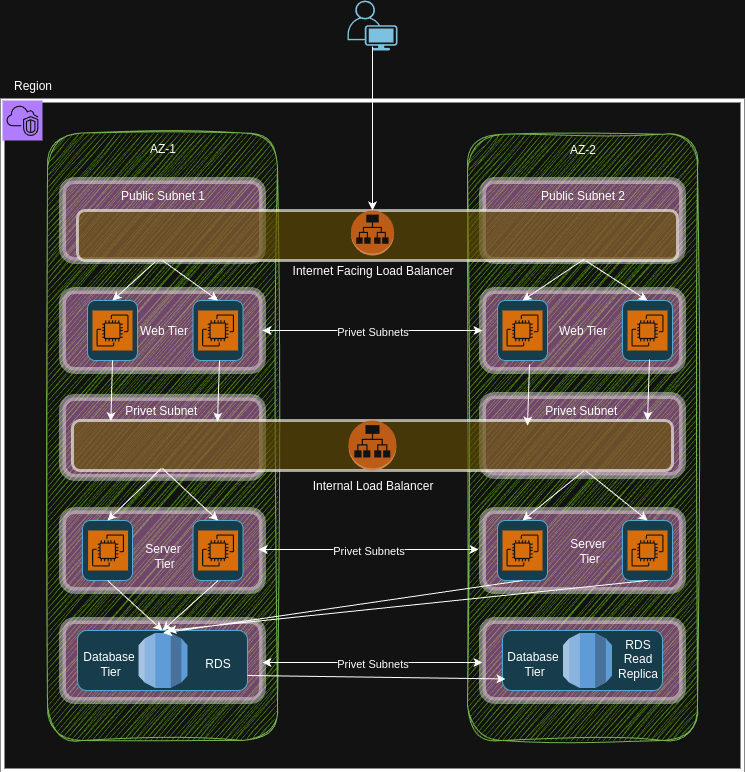

# 🚀 AWS Three Tier Architecture

This repository contains a comprehensive demonstration of deploying a modern **three-tier architecture** using Amazon Web Services (AWS), emphasizing scalability, security, and high availability.

---

## 🏗️ Overview

**Three-tier architecture** is a standard software design pattern that divides an application into three logical and physical computing tiers:

- **Presentation Tier (Web Tier) 🖥️:** The front-end layer that interacts directly with users, typically hosting static websites or web applications.
- **Application Tier (Logic Tier) ⚙️:** The middle layer responsible for handling application logic, data processing, and communication between the other layers.
- **Database Tier 🗄️:** The back-end layer dedicated to securely storing and managing data, typically using a relational database or other managed service.

This approach supports clear separation of concerns, scalability, and robust security boundaries.

---

## ✨ Features

- **Scalable 📈**: Each tier can be scaled independently using AWS Auto Scaling and Elastic Load Balancing.
- **Highly Available 🟢**: Designed with multiple availability zones for fault tolerance and disaster recovery.
- **Secure 🔒**: Implements security groups, subnets, and NACLs to strictly control access between tiers.
- **Modular 🧩**: Infrastructure can be managed through infrastructure-as-code.

---

## 🖼️ Architecture Diagram

The following architecture diagram visually illustrates the main AWS resources and network segmentation for each tier:

**Legend:**
- Typically uses an Elastic Load Balancer and public subnets.
- The *Presentation Tier* uses private subnets and hosts EC2 instances for web.
- The *Application Tier* uses private subnets and hosts EC2 instances (or containers running back-end services).
- The *Database Tier* resides in isolated private subnets and is powered by services such as Amazon RDS.

---

## 🛠️ AWS Resources Setup

This project leverages AWS core services to create a robust 3-tier architecture. The core components and how they interact are detailed below:

### 1. **VPC (Virtual Private Cloud) 🌐**
- Create a VPC to logically isolate your AWS resources.
- Define public subnets (for web load balancer) ,private subnets (for web tier) ,private subnets (for app tier), and isolated subnets (for database tier).
- Use appropriate route tables to control traffic.

### 2. **RDS (Relational Database Service) 🗄️**
- Deploy RDS in the database-tier private subnet.
- Enable Multi-AZ deployment for high availability.
- Apply security group rules to allow inbound connections only from the application tier.

### 3. **Load Balancer (ALB) 🎯**
- Deploy an **Application Load Balancer (ALB)** in the public subnet for the web tier.
- Set up a Target Group to route traffic to the Auto Scaling group of web/app servers.
- For the app layer, you may deploy an **internal ALB** to balance traffic between services securely.

### 4. **Auto Scaling Group (ASG) 📦**
- Create a **Launch Template** using the AMI of your application.
- Set up the ASG to launch instances in selected subnets, associating with the appropriate target group of the load balancer.
- Define scaling policies—specify minimum, maximum, and desired instance counts for high availability and cost control.
- Attaching an ASG to your load balancer ensures that new instances are automatically registered, and unhealthy ones are replaced for continuous service.

> **Typical Flow:**
> 1. 👤 User connects to the public load balancer (ALB) endpoint.
> 2. 📥 The ALB forwards request traffic to EC2 instances managed by the Auto Scaling Group in the application/web tier.
> 3. 🔄 The EC2 instances in the app tier interact with the RDS instance in the private subnet for all database operations.

---

## 📁 Project Structure

| File/Directory                     | Purpose                                                     |
|-------------------------------------|-------------------------------------------------------------|
| `index.html`                        | Sample front-end interface for the demo app                 |
| `index.js`                          | Example client-side logic                                   |
| `images/3-tire-arc.drawio.png`      | Visual diagram of AWS 3-tier architecture                   |
| `README.md`                         | Project documentation                                       |

---

## 🚀 Deployment Steps (High-Level)

1. **Create the VPC:** With appropriate public, private, and isolated subnets.
2. **Set Up Security Groups & NACLs:** Strictly control what traffic is allowed between the subnets/tiers.
3. **Deploy RDS:** In a private/isolated subnet, restrict access to app tier only.
4. **Create EC2 AMIs:** For both web and app tiers.
5. **Launch Templates:** Create templates using above AMIs for autoscaling.
6. **Configure Target Groups:** For your load balancers—one for public access (web tier) and optionally one for app (internal).
7. **Create Load Balancer(s):** Attach to the correct subnets and register target groups.
8. **Create Auto Scaling Groups:** Attach to launch templates, subnets, and corresponding load balancers for each tier.
9. **Test the Architecture:** Point to ALB DNS; verify access, scaling, and failover.

---

## 🏆 Best Practices

- Use **Multi-AZ deployment** for databases and application tiers.
- Store sensitive data (e.g., connection strings) in AWS Secrets Manager or Parameter Store.
- Enable AWS CloudWatch monitoring and set alarms for infrastructure health.
- Automate provisioning using tools like CloudFormation or Terraform for real-world deployments.

---

Feel free to fork the project, open issues, or submit pull requests to enhance documentation or features.

